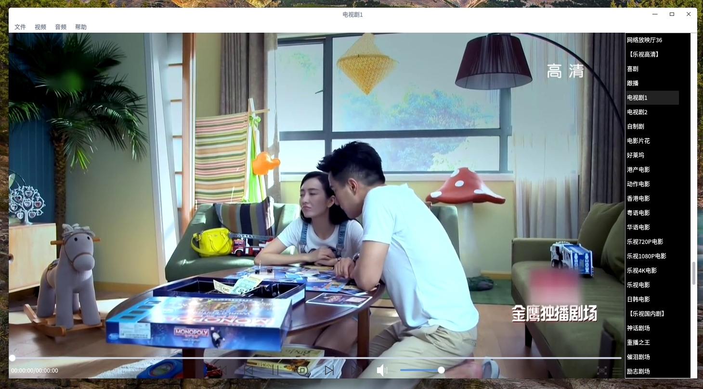

# 海天鹰媒体播放器_QtAV版
  
Linux 平台基于 Qt5 和 QtAV 的媒体播放程序。  
已编译好的 HTYMediaPlayer 程序适用64位Linux系统Qt5环境，双击运行，其他版本请自行编译。  

1.4版：浮动透明控制栏。

1.3版：直播列表并入窗体  
已知问题：某些操作会使直播列表跳到下一行。  

1.2版：增加剧情连拍  
  

1.1版：增加直播菜单。

## 错误排查：
error while loading shared libraties: libQtAVWdigets.so.1: cannot open shared object file: No such file or directory
Project ERROR: Unknown module(s) in QT: avwidgets  
sudo apt-get install qtav-sdk  

\#include <QtAV> no such file or directory  
工程pro文件增加： Qt += av  

'AVPlayer' does not name a type  
增加：using namespace QtAV;  
